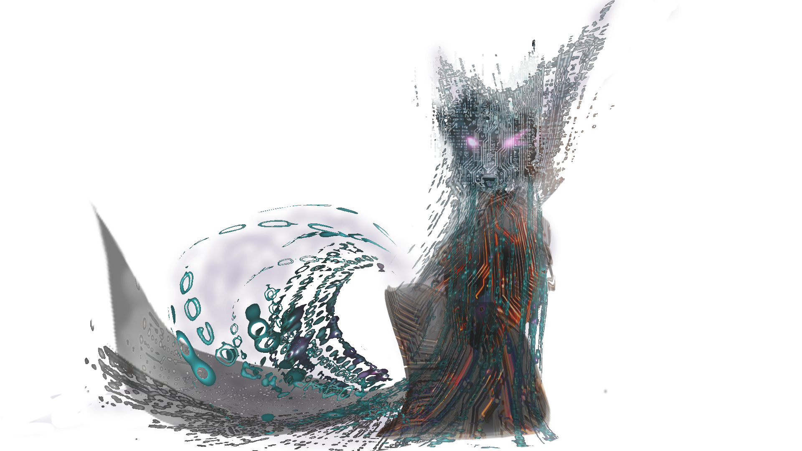

# Trash Fox Animation

A standalone web animation extracted from the Tsuki Cruz universe and preserved as an independent portfolio artifact.



---

## Overview

Originally developed as part of the **Tsuki Cruz** universe, this repository documents the extraction of the Trash Fox animation into an independent portfolio artifact, preserving its original visual behavior while presenting it as a self-contained digital exhibit.

Rather than showcasing an entire website, this repository focuses on the craftsmanship behind a single animated character—layered artwork, atmospheric composition, lightweight browser animation, and responsive front-end implementation.

---

## Design Intent

Trash Fox is presented as a self-contained digital exhibit rather than a webpage component.

By extracting the character from its original environment, the focus shifts entirely to the layered animation, subtle motion, and atmospheric composition.

The result extends beyond interface design, focusing instead on bringing a digital character to life through lightweight front-end techniques.

---

## Engineering Notes

- Extracted from a production Shopify theme.
- Converted into a standalone browser animation.
- Localized all assets.
- Removed framework dependencies.
- Preserved original animation behavior.
- Responsive layout retained.
- Published as an independent portfolio artifact.

---

## Animation Preview

The animation below was recorded directly from the standalone browser version contained in this repository.

▶ **[View the MP4](trash-fox-MP4.mp4)**

---

## Live Demo

Experience the live browser version here:

**https://tsuki-cruz.github.io/trash-fox-animation/**

The animation runs entirely in HTML, CSS, and JavaScript using locally referenced assets.

No frameworks, build process, or external dependencies are required.

If you'd like to explore the source locally:

```bash
git clone https://github.com/tsuki-cruz/trash-fox-animation.git
cd trash-fox-animation
```

Then simply open **index.html** in your browser.

---

## Repository Contents

- `index.html` – Standalone animation
- `fox_base.png` – Character base artwork
- Glow layers
- Spark layers
- Full-resolution exhibit image
- Demonstration MP4

---

## Closing

This repository documents the extraction of a production animation into a portable exhibit while preserving its original presentation and behavior.

It serves as both a technical reference and a portfolio piece demonstrating how layered digital artwork can be transformed into a lightweight, interactive browser experience.
